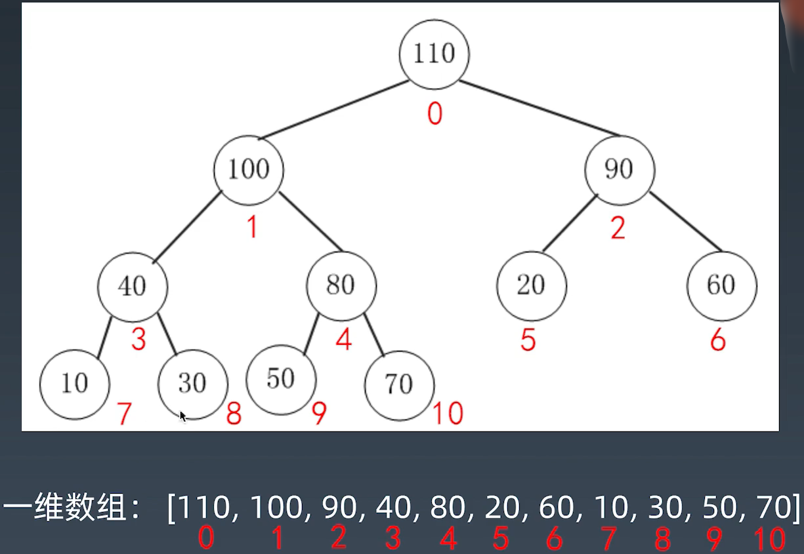
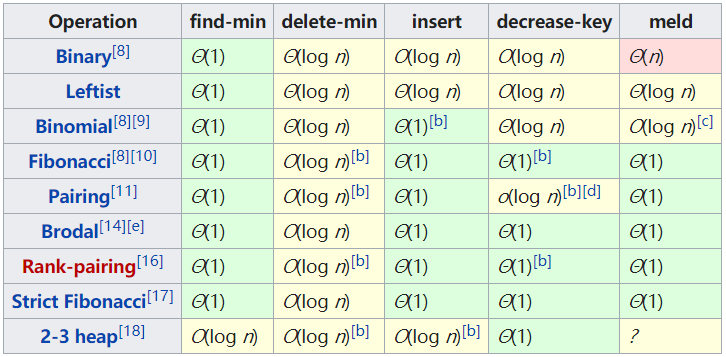

学习笔记

## 做题步骤

1. clarification
2. possible solutions --> optimal (time & space)
3. code 
4. test cases

# 树

## 二叉树

### 定义

```java
public class TreeNode {
    public int val;
    public TreeNode left,right;
    public TreeNode(int val){
        this.val = val;
        this.left = null;
        this.rigth = null;
    }
}
```

### 二叉树的遍历

1. 前序（Pre - order) ：根-左-右
2. 中序（In - order) : 左 - 根 - 右
3. 后序（Post-order）:左-右-根

### 二叉搜索树

1. 左子树上所有结点的值均小于它的根结点的值
2. 右子树上所有结点的值均大于它的根结点的值
3. 以此类推：左、右子树也分别为二叉查找树。（这就是 重复性！）

中序遍历：升序排序

删除节点：用第一个大于要删除结点的结点替换

它的查询和操作的复杂度都是 O(logn)

### 树的面试题解法一般都是递归，为什么？

因为每一个结点都可以作为根结点，并拥有左子树和右子树，一个问题可以化解成一个个的子问题，所以可以用递归解决。

# 堆

Heap: 可以迅速找到一堆数中的最大或者最小值的数据结构。

将根结点最大的堆叫做大顶堆或大根堆，根结点最小的堆叫做小顶堆或小根堆。

常见的堆有二叉树、斐波那契堆等。

## 时间复杂度

假设是大顶堆，则常见操作（API）:

find-max: O(1)

delete-max: O(logn)

insert(create): O(logn) or O(1)

## 二叉堆的性质

- 通过完全二叉树来实现
- 二叉堆（大顶）它满足下列性质：
  - 是一棵完全树
  - 树中任意结点的值总是 >= 其子节点的值

## 二叉堆实现细节

1. 二叉堆一般都通过“数组”来实现;

2. 假设“第一元素”在数组中的索引为0的话，则父节点和子节点的位置关系如下:

   - 索引为 i 的左孩子的索引是（2*i + 1）；

   - 索引为 i 的右孩子的索引是（2*i + 2）；

   - 索引为 i 的父节点的索引是 floor((i-1)/2);

     

   ## 插入操作

1. 新元素一律先插入到堆的尾部

2. 依次向上调整整个堆的结构（一直到根即可）（HeapifyUp）

   

   

   

   ## 删除堆顶操作（Delete Max）

   1. 将堆尾的元素替换到顶部（即堆顶被替换删除掉）

   2. 依次从根部向下调整整个堆的结构（一直到堆尾即可）

      HeapifyDown

      

      ## 堆的分类

      - [2–3 heap](https://en.wikipedia.org/wiki/2–3_heap)

      - [B-heap](https://en.wikipedia.org/wiki/B-heap)

      - [Beap](https://en.wikipedia.org/wiki/Beap)

      - [Binary heap](https://en.wikipedia.org/wiki/Binary_heap)

      - [Binomial heap](https://en.wikipedia.org/wiki/Binomial_heap)

      - [Brodal queue](https://en.wikipedia.org/wiki/Brodal_queue)

      - [*d*-ary heap](https://en.wikipedia.org/wiki/D-ary_heap)

      - [Fibonacci heap](https://en.wikipedia.org/wiki/Fibonacci_heap)

      - [K-D Heap](https://en.wikipedia.org/wiki/K-D_Heap)

      - [Leaf heap](https://en.wikipedia.org/w/index.php?title=Leaf_heap&action=edit&redlink=1)

      - [Leftist heap](https://en.wikipedia.org/wiki/Leftist_tree)

      - [Pairing heap](https://en.wikipedia.org/wiki/Pairing_heap)

      - [Radix heap](https://en.wikipedia.org/wiki/Radix_heap)

      - [Randomized meldable heap](https://en.wikipedia.org/wiki/Randomized_meldable_heap)

      - [Skew heap](https://en.wikipedia.org/wiki/Skew_heap)

      - [Soft heap](https://en.wikipedia.org/wiki/Soft_heap)

      - [Ternary heap](https://en.wikipedia.org/wiki/Ternary_heap)

      - [Treap](https://en.wikipedia.org/wiki/Treap)

      - [Weak heap](https://en.wikipedia.org/wiki/Weak_heap)

        

# 图

**面试和运用越来越少**

## 图的属性

- Graph(V, E)
- V - vertex: 点
  1. 度 - 入度和出度
  2. 点与点之间：连通与否

- E - edge：边
  1. 有向和无向（单行线）
  2. 权重（边长）

## 图的分类和表示

### 无向无权图


### 有向无权图


### 无向有权图


## 基于图的常见算法

DFS 和 BFS 要加上 visited 记录访问过的点

**DFS 代码**

```python
visited = set() # 和树中的DFS最大的区别
def dfs(node,visited):
    if node in visited: # terminator
        # already visited
        return
    
    visited.add(node)
    
    # process current node here.
    # ...
    for next_node in node.children():
        if not next_node in visited:
            dfs(next_node,visited)
```

**BFS 代码**

```python
def BFS(graph,start,end):
    queue = []
    queue.append([start])
    
    visited = set() # 和树中的BFS最大的区别
    
    while queue:
        node = queue.pop()
        visited.add(node)
        
        process(node)
        nodes = generate_related_nodes(node)
        queue.push(nodes)
```

### 高级算法

**Github 上有相应的适用于工程的实现**

**参考**

- 连通图个数：[ https://leetcode-cn.com/problems/number-of-islands/](https://leetcode-cn.com/problems/number-of-islands/)
- 拓扑排序（Topological Sorting）：[ https://zhuanlan.zhihu.com/p/34871092](https://zhuanlan.zhihu.com/p/34871092)
- 最短路径（Shortest Path）：Dijkstra https://www.bilibili.com/video/av25829980?from=search&seid=13391343514095937158
- 最小生成树（Minimum Spanning Tree）：[ https://www.bilibili.com/video/av84820276?from=search&seid=17476598104352152051](https://www.bilibili.com/video/av84820276?from=search&seid=17476598104352152051)