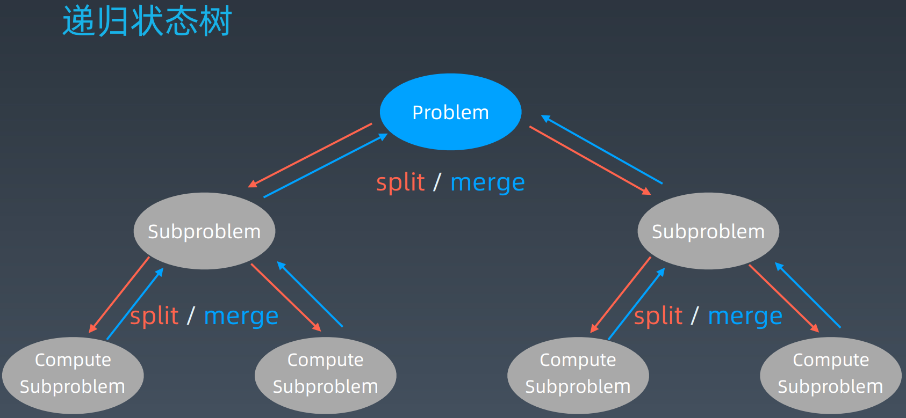

学习笔记

# 递归

## 代码模板

### Python

```python
# Python
def recursion(level, param1, param2, ...): 
    # recursion terminator 
    if level > MAX_LEVEL: 
	   process_result 
	   return 
    # process logic in current level 
    process(level, data...) 
    # drill down 
    self.recursion(level + 1, p1, ...) 
    # reverse the current level status if needed
```

### Java

```java
// Java
public void recur(int level, int param) { 
  // terminator 
  if (level > MAX_LEVEL) { 
    // process result 
    return; 
  }
  // process current logic 
  process(level, param); 
  // drill down 
  recur( level: level + 1, newParam); 
  // restore current status 
 
}
```

### Javascript

```javascript
// JavaScript
const recursion = (level, params) =>{
   // recursion terminator
   if(level > MAX_LEVEL){
     process_result
     return 
   }
   // process current level
   process(level, params)
   //drill down
   recursion(level+1, params)
   //clean current level status if needed
   
}
```

### C++

```c++
// C/C++
void recursion(int level, int param) { 
  // recursion terminator
  if (level > MAX_LEVEL) { 
    // process result 
    return ; 
  }

  // process current logic 
  process(level, param);

  // drill down 
  recursion(level + 1, param);

  // reverse the current level status if needed
}
```

## 思维要点

1. 不要人肉进行递归（最大的误区）

2. 找到最近最简方法，将其拆解成可重复解决的问题（重复子问题）

   > 为什么要找最近重复子问题?
   >
   > 因为我们写的程序只包括if else ，for和while loop，然后就是递归调用。而复杂的问题有重复性，所以都可以用很少的代码解决。

3. 数学归纳法

# 分治

## 递归状态树



## 代码模板

### Python

```python
# Python
def divide_conquer(problem, param1, param2, ...): 
  # recursion terminator 
  if problem is None: 
	print_result 
	return 

  # prepare data 
  data = prepare_data(problem) 
  subproblems = split_problem(problem, data) 

  # conquer subproblems 
  subresult1 = self.divide_conquer(subproblems[0], p1, ...) 
  subresult2 = self.divide_conquer(subproblems[1], p1, ...) 
  subresult3 = self.divide_conquer(subproblems[2], p1, ...) 
  …

  # process and generate the final result 
  result = process_result(subresult1, subresult2, subresult3, …)
	
  # revert the current level states
```

### Java

```java
private static int divide_conquer(Problem problem, ) {
  
  if (problem == NULL) {
    int res = process_last_result();
    return res;     
  }
  subProblems = split_problem(problem)
  
  res0 = divide_conquer(subProblems[0])
  res1 = divide_conquer(subProblems[1])
  
  result = process_result(res0, res1);
  
  return result;
}
```

### Javascript

```javascript
//Javascript
const divide_conquer = (problem, params) => {

  // recursion terminator

  if (problem == null) {

    process_result

    return

  } 

  // process current problem

  subproblems = split_problem(problem, data)

  subresult1 = divide_conquer(subproblem[0], p1)

  subresult2 = divide_conquer(subproblem[1], p1)

  subresult3 = divide_conquer(subproblem[2], p1)

  ...

  // merge

  result = process_result(subresult1, subresult2, subresult3)

  // revert the current level status

}
```

### C++

```c++
int divide_conquer(Problem *problem, int params) {
  // recursion terminator
  if (problem == nullptr) {
    process_result
    return return_result;
  } 

  // process current problem
  subproblems = split_problem(problem, data)
  subresult1 = divide_conquer(subproblem[0], p1)
  subresult2 = divide_conquer(subproblem[1], p1)
  subresult3 = divide_conquer(subproblem[2], p1)
  ...

  // merge
  result = process_result(subresult1, subresult2, subresult3)
  // revert the current level status
 
  return 0;
}
```

